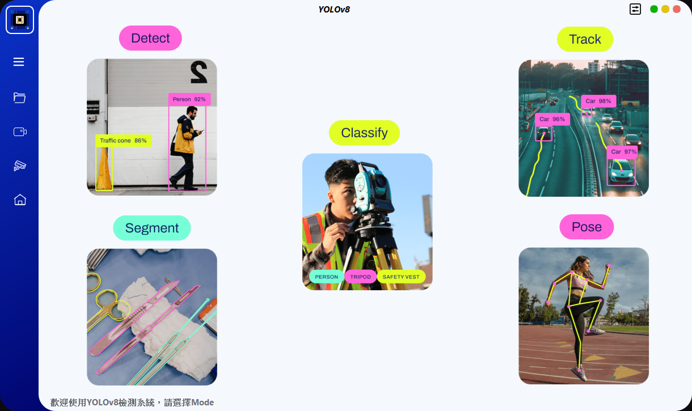

# YoloSide ~ A GUI For YOLOv8 `V2.1`
---
English | [繁體中文](./README_zh_tw.md)

## How to Run
- `python>=3.8`
- `pip install ultralytics==8.2.22`
- `pip install pyside6`
- `pip install chardet`
- `conda install pytorch torchvision torchaudio pytorch-cuda=11.8 -c pytorch -c nvidia`
- `python main.py`

#### !!The corresponding version of the library must be installed

## Notice
- `ultralytics` follows the `GPL-3.0`, if you need commercial use, you need to obtain its license.
- If you expect to use your own model, you need to use `ultralytics` to train the yolov8/5 model first, and then put the trained `.pt` file into the `models/*` folder.
- There are still some bugs in the software, and I will continue to optimize and add some more interesting functions as my time allows.
- If you check the save results, they will be saved in the `./run` path
- The UI design file is `home.ui`, if you modify it, you need to use the `pyside6-uic home.ui > ui/home.py` command to regenerate the `.py` file
- The resource file is `resources.qrc`, if you modify the default icon, you need to use the `pyside6-rcc resoures.qrc > ui/resources_rc.py` command to regenerate the `.py` file

## To Do
- [x] The input source supports camera
- [ ] if you need this function urgently, you can modify it according to the `chose_rtsp`、`load_rtsp` function in `main.py`
- [ ] Graph showing changes in target quantity
- [x] Target tracking
- [x] Instance segmentation
- [ ] Monitor system hardware usage

## References
- [PyQt5-YOLOv5](https://github.com/Javacr/PyQt5-YOLOv5)
- [ultralytics](https://github.com/ultralytics/ultralytics)
- [PySide6-YOLOv8](https://github.com/Jai-wei/YOLOv8-PySide6-GUI/tree/main)
