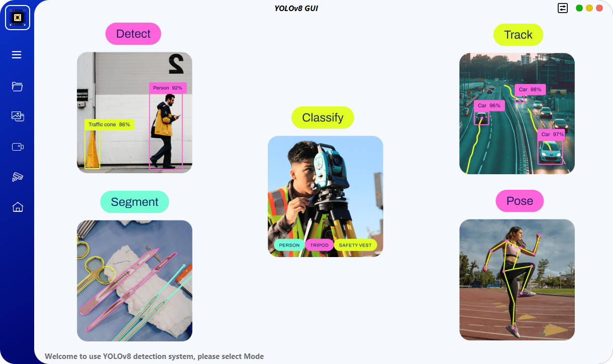

# YoloSide ~ A GUI For YOLOv8 `V2.4`
---
  <p align="center"> 
  English &nbsp; | &nbsp; <a href="https://github.com/SuPoTing/YOLOv8-GUI-PySide6/blob/main/README_zh_tw.md">繁體中文</a>
 </p>




## How to Run
### 1. Create virtual environment

Create a virtual environment equipped with python version 3.10, then activate environment. 

```shell
conda create --name yolov8-gui python=3.10
conda activate yolov8-gui
```
### 2. Install dependency packages 

```shell
pip install pyside6
pip install chardet
pip install pytube
pip install ultralytics==8.2.66
pip install torch==2.0.1 torchvision==0.15.2 torchaudio==2.0.2 --index-url https://download.pytorch.org/whl/cu118
```

### 3. Run Program
Traditional Chinese
```shell
python main.py
```
English
```shell
python main_en.py
```

## Packaging
### 1. Create virtual environment

It is recommended to use native Python to create a virtual environment and install Python 3.10.
```shell
python -m venv venv
(your YOLOv8-GUI-PySide6-main PATH)\venv\Scripts\activate.bat
```

### 2. Install dependency packages 

```shell
pip install pyside6
pip install chardet
pip install pytube
pip install ultralytics==8.2.66
pip install torch==2.0.1 torchvision==0.15.2 torchaudio==2.0.2 --index-url https://download.pytorch.org/whl/cu118
pip install lapx
pip install auto-py-to-exe
```

### 3. Launch the auto-py-to-exe UI

```shell
auto-py-to-exe
```

### 4. Add Script Location and Additional Files

Script Location
```shell
(your YOLOv8-GUI-PySide6-main PATH)\main.py
```

Add additional directories by clicking "Add Folder".
```shell
(your YOLOv8-GUI-PySide6-main PATH)\venv\Lib\site-packages\ultralytics
```

Click "Convert".

### 5. Copy Files
Copy the config, img, models, ui, and utils directories to (your YOLOv8-GUI-PySide6-main PATH)\output\main.

### 6. Launch main.exe
Run main.exe to start the application.

## Notice
- `ultralytics` follows the `AGPL-3.0`, if you need commercial use, you need to obtain its license.
- If you expect to use your own model, you need to use `ultralytics` to train the yolov5/6(only det)/8/9(det&seg)/10(only det) model first, and then put the trained `.pt` file into the `models/*` folder.
- There are still some bugs in the software, and I will continue to optimize and add some more interesting functions as my time allows.
- If you check the save results, they will be saved in the `./run` path
- The UI design file is `home.ui`, if you modify it, you need to use the `pyside6-uic home.ui > ui/home.py` command to regenerate the `.py` file
- The resource file is `resources.qrc`, if you modify the default icon, you need to use the `pyside6-rcc resoures.qrc > ui/resources_rc.py` command to regenerate the `.py` file
- In the Oriented bounding box (obb) mode in `Detect mode`, if you want to use your own trained obb model, you need to add `obb` to the filename, such as `yolov8n-obb.pt`. If "obb" is not added, it will only enter the general detection mode.
## Existing Features
### 1. Mode Selection
- Image Classification
- Object Detection
- Object Detection(OBB)
- Pose Estimation
- Instance Segmentation
- Object Tracking
### 2. Data Input Methods
- Single File Detection
- Folder(batch) detection function
- Support Dragging File Input
- Camera Input Support
- Support for 'chose_rtsp' and 'load_rtsp' Functions

## To Do
- [ ] Monitor system hardware usage
- [ ] Graph showing changes in target quantity

## References
- [PyQt5-YOLOv5](https://github.com/Javacr/PyQt5-YOLOv5)
- [ultralytics](https://github.com/ultralytics/ultralytics)
- [PySide6-YOLOv8](https://github.com/Jai-wei/YOLOv8-PySide6-GUI/tree/main)
- [YOLOSHOW](https://github.com/SwimmingLiu/YOLOSHOW/tree/31644373fca58aefcc9dba72a610c92031e5331b)
