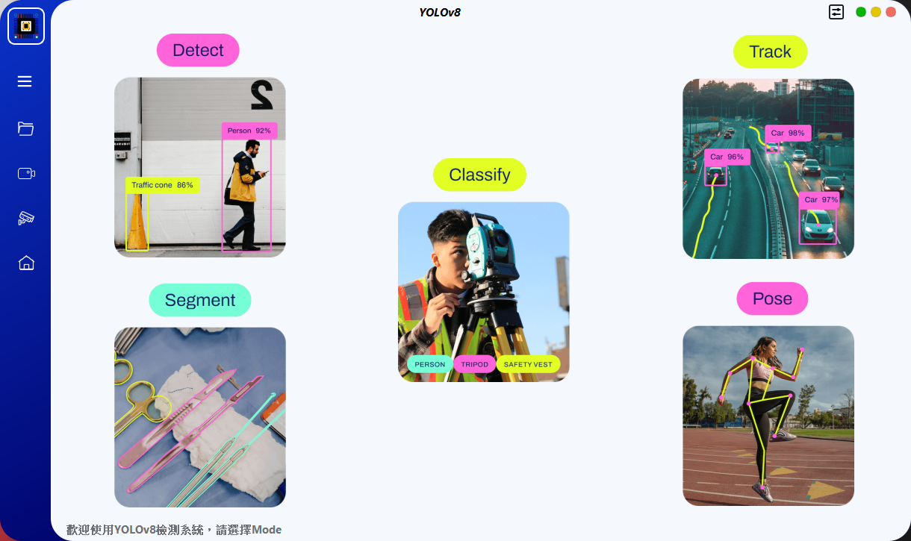

# YoloSide ~ A GUI For YOLOv8 `V2.1`
---

## 環境配置
- `python>=3.8`
- `pip install ultralytics==8.2.22`
- `pip install pyside6`
- `pip install chardet`
- `conda install pytorch torchvision torchaudio pytorch-cuda=11.8 -c pytorch -c nvidia`
- `python main.py`

#### !!必須安裝對應版本套件包

## 注意事項
- `ultralytics`遵循`GPL-3.0`，如果需要商業用途，需要取得其license。
- 如果您希望使用自己的model，則需要先使用`ultralytics`訓練yolov5/8/9的model，然後將訓練好的`.pt`檔案放入`models/*`資料夾中。
- 軟體還存在一些bug，我會在時間允許的情況下繼續優化並添加一些更有趣的功能。
- 如果您有儲存檢測結果，它們將保存在`./run`路徑中
- UI設計檔為`home.ui`，如果修改，需要使用`pyside6-uic home.ui > ui/home.py`指令重新產生`.py`檔案
- 資源檔案為`resources.qrc`，如果修改預設icon，需要使用`pyside6-rcc resoures.qrc > ui/resources_rc.py`指令重新產生`.py`檔案

## 未來方向
- [x] 輸入支援Camera
- [ ] 支援`chose_rtsp`、`load_rtsp`函數
- [ ] 顯示目標數量變化的圖表
- [x] 目標追蹤
- [x] 實例分割
- [ ] 監控系統硬體使用情況

## 參考文獻
- [PyQt5-YOLOv5](https://github.com/Javacr/PyQt5-YOLOv5)
- [ultralytics](https://github.com/ultralytics/ultralytics)
- [PySide6-YOLOv8](https://github.com/Jai-wei/YOLOv8-PySide6-GUI/tree/main)
