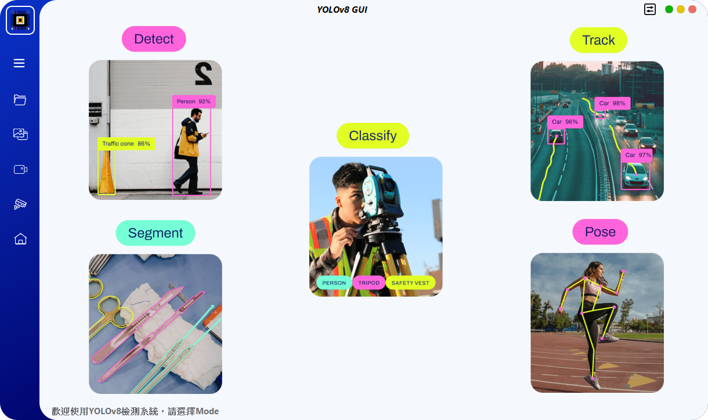

# YoloSide ~ A GUI For YOLOv8 `V2.4`
---
<p align="center"> 
  <a href="https://github.com/SuPoTing/YOLOv8-GUI-PySide6/blob/main/README.md"> English</a> &nbsp; | &nbsp; 繁體中文</a>
 </p>



## 實驗環境
### 1. 建立虛擬環境

建立一個python3.10版本的虛擬環境，然後啟動環境。

```shell
conda create --name yolov8-gui python=3.10
conda activate yolov8-gui
```
### 2. 安裝依賴套件包

```shell
pip install pyside6
pip install chardet
pip install ultralytics==8.2.50
pip install torch==2.0.1 torchvision==0.15.2 torchaudio==2.0.2 --index-url https://download.pytorch.org/whl/cu118
```

### 3. 執行程式
- 繁體中文
```shell
python main.py
```
- 英文
```shell
python main_en.py
```

## 打包
### 1. 建立虛擬環境

推薦使用原生python建立虛擬環境，安裝python3.10
```shell
python -m venv venv
(your YOLOv8-GUI-PySide6-main PATH)\venv\Scripts\activate.bat
```

### 2. 安裝依賴套件包

```shell
pip install pyside6
pip install chardet
pip install ultralytics==8.2.50
pip install torch==2.0.1 torchvision==0.15.2 torchaudio==2.0.2 --index-url https://download.pytorch.org/whl/cu118
pip install auto-py-to-exe
```

### 3. 啟動auto-py-to-exe UI介面

```shell
auto-py-to-exe
```

### 4. 添加腳本位置以及附加檔案

腳本位置
```shell
(your YOLOv8-GUI-PySide6-main PATH)\main.py
```

附加檔案點選新增目綠
```shell
(your YOLOv8-GUI-PySide6-main PATH)\venv\Lib\site-packages\ultralytics
```

點選轉換

### 5. 複製檔案
將`conig`、`img`、`models`、`ui`、`utils`複製到`(your YOLOv8-GUI-PySide6-main PATH)\output\main`

### 6. 啟動main.exe
運行main.exe以啟動應用程式。

## 注意事項
- `ultralytics`遵循`GPL-3.0`，如果需要商業用途，需要取得其license。
- 如果您希望使用自己的model，則需要先使用`ultralytics`訓練yolov5/6(only det)/8/9(det&seg)/10(only det)的model，然後將訓練好的`.pt`檔案放入`models/*`資料夾中。
- 軟體還存在一些bug，我會在時間允許的情況下繼續優化並添加一些更有趣的功能。
- 如果您有儲存檢測結果，它們將保存在`./run`路徑中。
- UI設計檔為`home.ui`，如果修改，需要使用`pyside6-uic home.ui > ui/home.py`指令重新產生`.py`檔案。
- 資源檔案為`resources.qrc`，如果修改預設icon，需要使用`pyside6-rcc resoures.qrc > ui/resources_rc.py`指令重新產生`.py`檔案。
- 旋轉框模式在`Detect mode`，如果要使用自己訓練的obb模型，需要在檔名中加`obb`，如`yolov8n-obb.pt`，未加obb只會進入一般偵測模式。

## 現有功能
### 1.模式選擇
- 影像分類
- 物體偵測
- 物體偵測(OBB)
- 姿態檢測
- 實例分割
- 目標追蹤
### 2.資料輸入方式
- 單一檔案檢測功能
- 資料夾(批次)檢測功能
- 支持拖移檔案輸入
- 輸入支援Camera
- 支援`chose_rtsp`、`load_rtsp`函數

## 未來方向
- [ ] 監控系統硬體使用情況
- [ ] 顯示目標數量變化的圖表

## 參考文獻
- [PyQt5-YOLOv5](https://github.com/Javacr/PyQt5-YOLOv5)
- [ultralytics](https://github.com/ultralytics/ultralytics)
- [PySide6-YOLOv8](https://github.com/Jai-wei/YOLOv8-PySide6-GUI/tree/main)
- [YOLOSHOW](https://github.com/SwimmingLiu/YOLOSHOW/tree/31644373fca58aefcc9dba72a610c92031e5331b)

